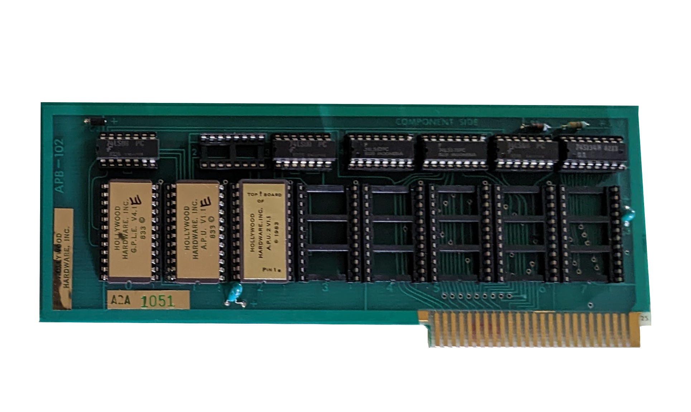
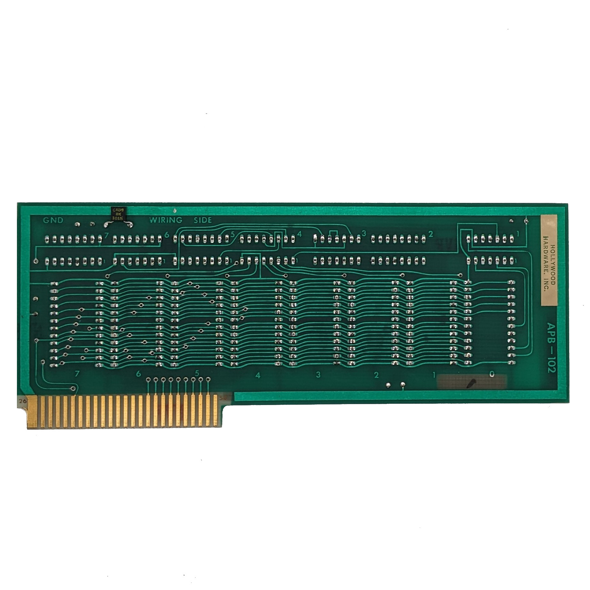
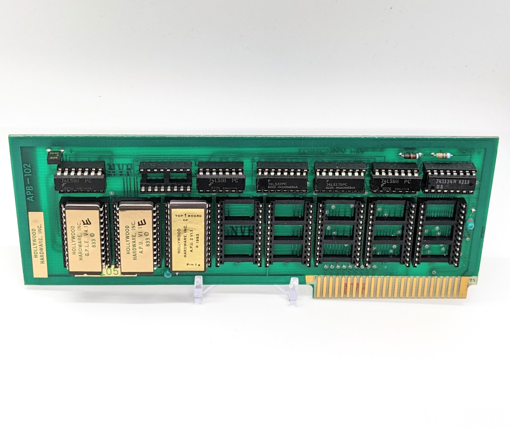

# Apple II Hollywood Hardware APB-102 "Ultra-ROM" Board
**Firmware Enhancement System - ROM Dumps & Hardware Archive**

This archive contains the ROM dumps and high-resolution PCB photos of the Hollywood Hardware APB-102 Ultra-ROM Board, a 1983 hardware expansion for the Apple II, II+, and //e.

This hardware allowed up to 32K of ROM space to be mapped into the Apple II without consuming user RAM, utilizing automatic bank-switching.

## 1. Archive Contents
* **`rom0.bin`** - [Socket 0] Contains the Firmware Management System (FMS) and the Global Program Line Editor (G.P.L.E. V4.1E).
* **`rom1.bin`** - [Socket 1] Contains the Ampersand Programmer's Utility (A.P.U. V1.1E). Provides 25+ Applesoft utilities.
* **`rom2.bin`** - [Socket 2] Contains the Ampersand Programmer's Utility 2 (A.P.U. 2 V1.1, ©1983).
* **High-resolution photos** of the APB-102 PCB (component side and wiring side) showing the 7400-series logic gate layout used for bank switching.

## 2. Hardware & Reverse-Engineering Notes
*(Notes provided by [@munsie](https://github.com/munsie) who dumped the ROMs):*

> "The first 256 bytes of ROM 0 is mapped into the `$Cx00` - `$CxFF` area for the card (replace X with the slot number). When a ROM is selected, it shows up in the `$C800` - `$CFFE` area (`$CFFF` turns off access to the ROM, as is standard for most Apple II cards).
> 
> The way you select which ROM is active is by using the IO space at `$Cx80` - `$Cx87`. Basically, whichever IO address you read from will be used to turn on the corresponding ROM — i.e, `$Cx82` selects ROM 2, `$Cx80` selects ROM 0, etc. There are only 8 sockets on the board, so that’s why it is `$Cx80` - `$Cx87`. But the high bit of the least significant nibble is ignored, so you can also say `$Cx88` for ROM 0, `$Cx89` for ROM 1, etc.
> 
> In theory, any 4KB ROM/EEPROM should work in the empty slots. If there was functionality for calling into different banks exposed, it would be in the bottom 256 bytes of ROM 0 since that is always mapped into memory and is what’s called when you do a `PR#X`."

## 3. Historical Context 
*(From the original 1983 Advertisement)*

> **The Hollywood Hardware Firmware Enhancement System**
> 
> We take all the enhancements that transform the Apple from a novelty to a powerful instrument, and hook them into the operating system, installed on their own FIRMWARE card. NO disk loading, NO loss of available memory space, NO interface with other programs. The system never need be removed - it is unhooked with two keystrokes, rehooked with four. 
> 
> * **a) The ULTRA-ROM BOARD (APB102A):** Installs 32K of firmware space in any slot.
> * **b) GPLE 4.2:** Enhanced version of the original editor. 
> * **c) FMS:** The FIRMWARE MANAGEMENT SYSTEM. Finds and enables the desired routine with automatic bank switching.
> * **d) APU-1:** Over 25 UTILITIES. Invoked by the "&" key.
> * **e) APU-2:** super RENUMBER, multiHIDE, multiMERGE, VARIABLE CROSS REFERENCE.
> 
> *Hollywood Hardware, Van Nuys, CA (1983-1984)*

## 4. Documentation & Manuals
A massive thank you to the archives at [Apple2Online](https://apple2online.com) for preserving the original documentation for this hardware. If you are configuring this board or using the APU extensions, you can find the complete manuals below:

* [Hollywood Hardware Ultra ROM Board APB-102 Owner's Manual](https://apple2online.com/wp-content/uploads/Hollywood-Hardware-Ultra-ROM-Board-Editor-Manual-KBS.pdf)
* [Hollywood Hardware APB-102 Quick Reference Guide](https://apple2online.com/wp-content/uploads/Hollywood-Hardware-Ultra-ROM-Board-Editor-QRG-KB.pdf)
* [Two-page Data Sheet](https://apple2online.com/wp-content/uploads/Hollywood-Hardware-Ultra-ROM-Board-Editor-Data-Sheet-KB.pdf)
* [Warranty Card](https://apple2online.com/wp-content/uploads/Hollywood-Hardware-Ultra-ROM-Board-Editor-Warranty-Card.pdf)

## 5. Hardware Reference Photos

**Component Side (Front)**

**Wiring Side (Back)**

**Fully Populated Setup**

---
*Preserved for the retrocomputing community.*
